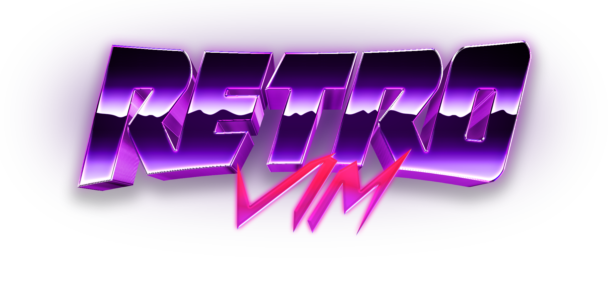

<div align="center">



A fully themed Neovim configuration with a live theme engine, built-in settings panel, terminal color syncing, and 17 curated themes.

<p align="center">
  
  
  
  
</p>

<p align="center">
  
  
  
  
  
  
  
  
  
  
  
  
  
  
  
  
  
  
  
  
  
  
  
</p>

</div>

<p align="center">
  
</p>

## 🎨 What is RetroVim

RetroVim is a **synthwave-inspired Neovim configuration** with a fully integrated theme engine — live theme switching, terminal color syncing, a built-in settings panel, and 17 curated themes out of the box.

One config to rule the editor: **23 language servers** via Mason with autocompletion, formatting and linting. **blink.cmp** for fast completions. **Treesitter** for syntax highlighting. **Snacks.nvim** dashboard, picker, explorer, terminal, lazygit, scratch buffers, profiler, image hover and notifications. **Session persistence**, **git integration** with diff viewer and hunk staging, **markdown preview**, and a **terminal-aware System theme** that syncs to your Kitty palette in real time.

**Built by a developer, for developers.** Every theme is a Lua file you can edit, every setting is persisted to JSON, and every keymap is documented. Drop custom themes in `~/.config/retrovim/themes/` and they appear in the picker automatically.

> A **Neovim** config that looks as good as it works — synthwave neon on the outside, serious editor on the inside.

---

## 🚀 Features

| | |
|---|---|
| 🎨 **Live Theme Engine** | 17 built-in themes with instant switching. Live color swatch previews in the picker. Dark/Light mode toggle. Transparency and Lualine transparency options. Custom background override for any theme. Custom themes via `~/.config/retrovim/themes/`. |
| 🎛️ **Built-in Settings Panel** | A full control panel accessible from the dashboard (`<space>qs`). Theme picker, transparency, dark mode, background override, bufferline style, tree style, kitty sync interval, reset to defaults — all in one place. |
| 🧩 **LSP & Completion** | 23 language servers via Mason (TypeScript, Go, Rust, C/C++, Python, Lua, Svelte, Tailwind CSS, and more). **blink.cmp** for fast Rust-powered autocompletion with LSP, snippets, path and buffer sources. Ghost text suggestions. Auto-brackets on accept. |
| 🌳 **File Explorer** | **Neo-tree** sidebar with git status, diagnostics, clipboard sync, file operations (add/delete/rename/copy/move). **Snacks Explorer** with tree view, live diagnostics, git untracked, and keyboard-driven file management. |
| 🔍 **Fuzzy Finding & Search** | **Snacks Picker** with fuzzy matching, frecency, smartcase, and 20+ sources: files, git files, buffers, recent, projects, grep, live grep, diagnostics, help, highlights, keymaps, man pages, marks, registers, undo history, and more. **Grug-far** for project-wide search and replace with live preview. |
| 📝 **Editing** | **Flash.nvim** for jump/search with labels. **TreeSJ** for splitting/joining code blocks. **nvim-surround** for bracket/quote wrapping. **nvim-autopairs** for auto-closing brackets. **Comment.nvim** for context-aware commenting. **toggle-bool** for flipping true/false. **blink.cmp** for completion. **Treesitter** for incremental selection and text objects. |
| 🔄 **Git** | **Gitsigns** for sign column indicators, hunk staging and resetting. **Diffview** for enhanced git diff and file history. **Lazygit** integration via Snacks. **Snacks.gitbrowse** to open files on GitHub. **Snacks.git** for blame, log, stash, and GitHub issues/PRs. |
| 🖥️ **UI** | **Bufferline** with customizable separators. **Lualine** with LSP progress. **Noice** for modern cmdline and popupmenu UI. **nvim-scrollbar** with git and diagnostic markers. **Which-key** for keymap discovery. **Snacks dashboard** with update checker. **Snacks notifications** with compact style. **Snacks statuscolumn** with marks, signs, folds and git. **Snacks indent** with scope highlighting. **Snacks scroll** with smooth animation. |
| 🛠️ **Tooling** | **Conform.nvim** for format-on-save (Biome, Prettier, Stylua, shfmt, gofumpt). **nvim-lint** for async linting (ESLint, golangci-lint, pylint). **Trouble** for diagnostics/symbols/references panel. **Snacks profiler** for performance profiling. **Snacks terminal** with auto-close. **Snacks scratch** buffers with autowrite. |
| 💾 **Sessions & Persistence** | **Persisted.nvim** for automatic session save/restore, git branch-aware. **Snacks.bigfile** handler that disables features for files over 1.5MB. |
| 🔄 **Terminal Sync** | System theme that reads your terminal's color palette from Kitty config. Configurable sync interval (5s, 15s, 30s, 60s). Automatic detection of terminal colors via `vim.g.terminal_color_*` with fallback colors. |
| 🔌 **PlatformIO** | Embedded/IoT development integration — `Pioinit`, `Piorun`, `Piomon`, `Piodebug` and more. Auto-detects `platformio.ini`. |

---

## 🎭 Built-in Themes

Switch your entire look in one shot. Pick a palette, apply it, done — or drop in your own Lua themes, nothing is locked down.

<p align="center">
  
  
  
  
  
  
</p>

<p align="center">
  
  
</p>

<p align="center">
  
  
</p>

<p align="center">
  
  
</p>

<sub>Themes live in `lua/vlxd/themes/` as Lua tables — 17 and counting. Drop custom themes in `~/.config/retrovim/themes/` and they appear in the picker automatically.</sub>

---

## 📋 Requirements

### Required

| Package | Version | Why |
|---|---|---|
| `neovim` | >= 0.11 | Core editor (`vim.lsp.config`, `vim.lsp.enable` APIs) |
| `nodejs` + `npm` | >= 18 | markdown-preview.nvim build, Mason tools (biome, prettierd, eslint_d, jsonlint) |
| `git` | any | Version control, plugin management, gitsigns, diffview, lazygit, update checker |
| `gcc` or `clang` | any | Treesitter parser compilation (C compiler required) |
| `xclip` or `xsel` | any | System clipboard integration (`vim.opt.clipboard = "unnamedplus"`) |
| Nerd Font | v3+ | Icons throughout (bufferline, neo-tree, lualine, snacks, completion) |

### Language-specific (install if you use these languages)

| Package | Version | Why |
|---|---|---|
| `go` | >= 1.21 | Mason tools: `gopls`, `gofumpt`, `goimports`, `golangci-lint` |
| `rustup` + `cargo` | any | Mason tool: `codelldb` (Rust/C/C++ debugger) |
| `clangd` + `clang-format` | any | C/C++ LSP and formatting |

### Optional (recommended)

| Package | Version | Why |
|---|---|---|
| `lazygit` | >= 0.40 | Snacks lazygit integration (`<leader>lg`) |
| `python3` + `pip` | any | Mason tool: `pylint` (Python linter) |

### Arch Linux

```bash
sudo pacman -S neovim nodejs npm git gcc xclip lazygit go
```

### Ubuntu / Debian

```bash
sudo apt install neovim nodejs npm git gcc xclip golang-go
# lazygit: https://github.com/jesseduffield/lazygit#installation
```

### macOS

```bash
brew install neovim node git gcc xclip go lazygit
```

---

## 📦 Installation

```bash
# Backup existing config
mv ~/.config/nvim ~/.config/nvim.bak

# Clone RetroVim
git clone https://github.com/itsvlxd/retrovim ~/.config/nvim

# Start Neovim — plugins, LSP servers, formatters and linters auto-install
# Requires Neovim >= 0.11 (vim.lsp.config / vim.lsp.enable)
nvim
```

---

## 🔧 Configuration

### 🎛️ Settings Panel

Open the settings panel from the dashboard or with:

```lua
:lua require("vlxd.lib.retro").control_panel()
```

Settings are saved to `~/.local/state/nvim/retrovim/theme_config.json`.

### 🎨 Custom Themes

Drop `.lua` theme files in `~/.config/retrovim/themes/`. They'll appear in the theme picker automatically.

Example theme file:

```lua
return {
    title = "My Theme",
    description = "A custom dark theme",
    syntax = {
        ["@function"] = { fg = "${blue}", bold = true },
        ["@keyword"] = { fg = "${purple}", bold = true },
        ["@string"] = { fg = "${green}" },
    },
    darkMode = {
        bg = "#1a1a2e",
        fg = "#e0e0e0",
        red = "#ff6b6b",
        orange = "#ffa502",
        yellow = "#ffd93d",
        green = "#6bcb77",
        cyan = "#4ecdc4",
        blue = "#4d96ff",
        dark_blue = "#16213e",
        purple = "#9b59b6",
        white = "#dcdcdc",
        black = "#0f0f0f",
        gray = "#2d2d2d",
        dark_gray = "#1a1a1a",
        highlight = "#ff6b9d",
        cursor_line = "#252540",
        comment = "#6a6a8a",
        none = "NONE",
    },
    lightMode = {
        bg = "#f5f5f5",
        fg = "#2d2d2d",
        -- ... light palette
    },
}
```

### 🔄 System Theme

The **System** theme syncs to your terminal's color palette. It reads from:

1. `~/.config/retro/themes/kitty-colors.conf` (if exists)
2. `vim.g.terminal_color_*` variables
3. Hardcoded fallback colors

The sync interval is configurable (5s, 15s, 30s, 60s) from the settings panel.

### 🖌️ Background Override

Override the background color of any theme from the settings panel (key `g`). Preset colors from existing themes are available, or enter a custom hex value.

---

## ⌨️ Keymaps

> Leader key is `Space`. All keymaps are in Normal mode unless noted.

### 🧭 General

| Key | Action |
|---|---|
| `jk` | Exit insert mode |
| `Space` | Leader key |

### ✏️ Editing

| Key | Mode | Action |
|---|---|---|
| `d` | Normal/Visual | Delete (no yank) |
| `D` | Normal/Visual | Delete line (no yank) |
| `c` | Normal | Change (no yank) |
| `x` | Normal/Visual | Delete char (no yank) |
| `p` | Visual | Paste over selection |
| `J` | Visual | Move selection down |
| `K` | Visual | Move selection up |
| `<leader>tb` | Normal | Toggle boolean (true/false) |

### 📑 Buffers & Splits

| Key | Action |
|---|---|
| `<S-h>` / `<S-l>` | Prev / Next buffer |
| `<leader>sv` | Split vertically |
| `<leader>sh` | Split horizontally |
| `<leader>se` | Equal split size |
| `<leader>sx` | Close split |
| `<leader>sm` | Maximize/minimize split |
| `<C-h/j/k/l>` | Navigate windows (+ Tmux panes) |

### 🔍 Find & Pick (<leader>f)

| Key | Action |
|---|---|
| `<leader><space>` | Smart find files (cwd-aware) |
| `<leader>ff` | Find files |
| `<leader>fg` | Find git files |
| `<leader>fb` | Buffers |
| `<leader>fr` | Recent files |
| `<leader>fp` | Projects |
| `<leader>fn` | Notification history |
| `<leader>fi` | Icons |
| `<leader>fj` | Jumps |
| `<leader>fk` | Keymaps |
| `<leader>fm` | Marks |
| `<leader>fM` | Man pages |
| `<leader>fu` | Undo history |
| `<leader>ft` | Todo comments |
| `<leader>fT` | Todo/Fix/Fixme |

### 🔎 Search & Replace (<leader>s)

| Key | Action |
|---|---|
| `s` | Flash jump |
| `S` | Flash treesitter |
| `r` | Remote flash (operator) |
| `R` | Treesitter search (operator) |
| `<C-s>` | Toggle flash search (command line) |
| `<leader>sg` | Grep (project-wide) |
| `<leader>sw` | Grep word under cursor (n, x) |
| `<leader>ss` | Grep |
| `<leader>sb` | Buffer lines |
| `<leader>sB` | Grep open buffers |
| `<leader>sd` | Diagnostics |
| `<leader>sD` | Buffer diagnostics |
| `<leader>sc` | Command history |
| `<leader>sC` | Commands |
| `<leader>sh` | Help pages |
| `<leader>sH` | Highlights |
| `<leader>sl` | Location list |
| `<leader>sq` | Quickfix list |
| `<leader>sR` | Resume last picker |
| `<leader>s"` | Registers |
| `<leader>s/` | Search history |
| `<leader>sa` | Autocmds |
| `<leader>sp` | Grug-far (project-wide replace) |

### 🔄 Git (<leader>g)

| Key | Action |
|---|---|
| `<leader>gb` | Git blame line |
| `<leader>gl` | Git log |
| `<leader>gL` | Git log (line range) |
| `<leader>gf` | Git log (current file) |
| `<leader>gS` | Git stash |
| `<leader>gB` | Open file on GitHub |
| `<leader>gi` | GitHub issues (open) |
| `<leader>gI` | GitHub issues (all) |
| `<leader>gp` | GitHub PRs (open) |
| `<leader>gP` | GitHub PRs (all) |
| `<leader>lg` | Lazygit |
| `<leader>lf` | Lazygit (current file history) |
| `]h` / `[h` | Next / Prev git hunk |
| `<leader>hs` | Stage hunk |
| `<leader>hr` | Reset hunk |
| `<leader>dv` | Diffview open |
| `<leader>df` | Diffview file history |
| `<leader>dx` | Diffview close |

### 🧩 LSP

| Key | Action |
|---|---|
| `gd` | Definitions (picker) |
| `gr` | References (picker) |
| `gi` | Implementations (picker) |
| `gt` | Type definitions (picker) |
| `gD` | Declaration |
| `K` | Hover documentation |
| `<leader>rn` | Rename symbol |
| `<leader>ca` | Code action |
| `<leader>rs` | Restart LSP server |
| `<leader>d` | Line diagnostics (float) |
| `[d` / `]d` | Prev / Next diagnostic |
| `<leader>dx` | Workspace diagnostics |
| `<leader>D` | Buffer diagnostics |
| `<leader>ch` | Switch source/header (C/C++) |

### 🔧 Formatting & Linting

| Key | Action |
|---|---|
| `<leader>mp` | Format file (Conform) |
| `<leader>l` | Trigger linting |

### 🌳 Treesitter

| Key | Action |
|---|---|
| `<C-a>` | Increment selection |
| `<bs>` | Decrement selection |
| `]a` / `[a` | Next / Prev tag |
| `<leader>m` | Toggle split/join |
| `<leader>j` | Join block |
| `<leader>s` | Split block |

### ❌ Trouble

| Key | Action |
|---|---|
| `<leader>tx` | Diagnostics panel |
| `<leader>tX` | Buffer diagnostics panel |
| `<leader>ts` | Symbols panel |
| `<leader>tl` | LSP definitions/references |
| `<leader>tL` | Location list |
| `<leader>tQ` | Quickfix list |

### 🖥️ Terminal & Tools

| Key | Action |
|---|---|
| `<leader>nt` | Toggle terminal |
| `<leader>pt` | Terminal (current file directory) |
| `<leader>ee` | Neo-tree toggle |
| `<space>qs` | Settings panel |
| `<leader>cn` | Rename file |
| `<leader>nh` | Clear search highlights |
| `<leader>rb` | Reload buffer |
| `<leader>md` | Toggle markdown preview |
| `<leader>.` | Toggle scratch buffer |
| `<leader>S` | Select scratch buffer |
| `<leader>ih` | Image hover |
| `<leader>pp` | Profiler toggle |
| `<leader>ps` | Profiler scratch buffer |

### 🔤 Completion (blink.cmp)

| Key | Mode | Action |
|---|---|---|
| `<Tab>` | Insert | Accept / next item |
| `<S-Tab>` | Insert | Previous item |
| `<C-space>` | Insert | Toggle documentation |
| `<C-e>` | Insert | Hide completion |
| `<C-b>` / `<C-f>` | Insert | Scroll docs up / down |

---

## ❓ FAQ

<details open>
<summary><b>🧭 Do I need to configure anything after installing?</b></summary>
<br>
No. RetroVim works out of the box — all plugins, language servers, formatters and linters install automatically on first launch via Mason. Just open Neovim and start editing.
</details>

<details>
<summary><b>🎨 How do I add my own theme?</b></summary>
<br>
Drop a `.lua` file in `~/.config/retrovim/themes/` following the example in Configuration. It will appear in the theme picker automatically with a "(Custom)" tag.
</details>

<details>
<summary><b>🔄 How does the System theme work?</b></summary>
<br>
The System theme reads your terminal's color palette from Kitty's config file (`~/.config/retro/themes/kitty-colors.conf`), falls back to `vim.g.terminal_color_*` variables, and uses hardcoded fallback colors if neither is available. It watches the file for changes and syncs automatically at a configurable interval.
</details>

<details>
<summary><b>💻 Can I use this with a terminal other than Kitty?</b></summary>
<br>
Yes. The System theme gracefully falls back to `vim.g.terminal_color_*` variables (set by most modern terminals) and hardcoded synthwave colors. The kitty file parser is only used when the file exists.
</details>

<details>
<summary><b>⬆️ How do I update RetroVim?</b></summary>
<br>
Open the dashboard and press `u` when an update is available, or run:
```bash
cd ~/.config/nvim && git pull
```
Plugins will update automatically on next launch via Lazy.
</details>

---

## ❤️ Contributing

RetroVim is open source (MIT) and community-driven. Contributions, bug reports and feature ideas are all welcome.

- 🐛 **Found a bug?** — open an [issue](https://github.com/itsvlxd/retrovim/issues)
- 🔧 **Want to contribute?** — fork, create a branch, and open a [pull request](https://github.com/itsvlxd/retrovim/pulls)
- 🎨 **Built a theme?** — share it or drop it in `~/.config/retrovim/themes/`

<p align="center">
  <a href="https://github.com/itsvlxd/retrovim/graphs/contributors"></a>
  <a href="https://github.com/itsvlxd/retrovim/issues"></a>
  <a href="https://github.com/itsvlxd/retrovim/pulls"></a>
</p>

<br><br>
---
<div align="center">
  
  
  <sub>&copy; 2026 itsvlxd & Contributors &bull; <a href="https://github.com/itsvlxd/retrovim/blob/main/LICENSE">MIT License</a> &nbsp;&nbsp;|&nbsp;&nbsp; <a href="https://github.com/itsvlxd/retrovim/pulls">Contributing</a> &bull; <a href="https://github.com/itsvlxd/retrovim/issues">Issues</a> &bull; <a href="https://github.com/itsvlxd/retrovim/pulls">Pulls</a></sub>
  <br>
  <sub><i>Licensed under the MIT License. You are free to use, modify, and redistribute this software under the same permissive terms, provided completely without warranty of any kind.</i></sub>
</div>
